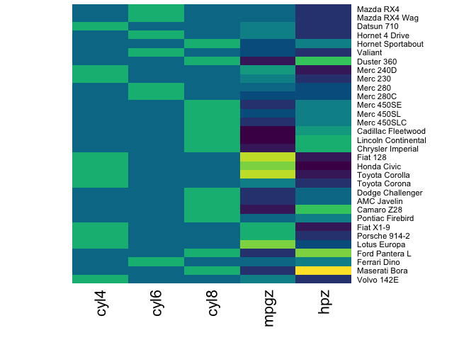

<!-- README.md is generated from README.Rmd. Please edit that file -->

# neuromat

<!-- badges: start -->

[](https://github.com/capro-uio/neuromat/actions/workflows/R-CMD-check.yaml)
[](https://CRAN.R-project.org/package=neuromat)
[](https://lifecycle.r-lib.org/articles/stages.html#experimental)
[](https://app.codecov.io/gh/capro-uio/neuromat?branch=main)
<!-- badges: end -->

Running vertex-wise linear mixed effects models in
[Freesurfer](https://surfer.nmr.mgh.harvard.edu/fswiki/LinearMixedEffectsModels)
requires a specific file format. The qdec format requires neatly created
binary columns for categorical value levels, and is made more efficient
if continuous variables are scaled (or de-meaned). This package provides
functions to create these files from R.

## Installation

You can install the development version of `neuromat` like so:

``` r
# Install Capro R-universe
install.packages('neuromat', 
  repos = 'https://capro-uio.r-universe.dev')
```

## Example

``` r
library(neuromat)
cars <- mtcars
cars$cyl <- factor(cars$cyl)
cars$gear <- factor(cars$gear)
qdec <- make_fs_qdec(cars, mpg ~ -1 + cyl + hp)
qdec
#>                   cyl4 cyl6 cyl8       mpgz        hpz
#> Mazda RX4            0    1    0  0.1508848 -0.5350928
#> Mazda RX4 Wag        0    1    0  0.1508848 -0.5350928
#> Datsun 710           1    0    0  0.4495434 -0.7830405
#> Hornet 4 Drive       0    1    0  0.2172534 -0.5350928
#> Hornet Sportabout    0    0    1 -0.2307345  0.4129422
#> Valiant              0    1    0 -0.3302874 -0.6080186
#> Duster 360           0    0    1 -0.9607889  1.4339030
#> Merc 240D            1    0    0  0.7150178 -1.2351802
#> Merc 230             1    0    0  0.4495434 -0.7538702
#> Merc 280             0    1    0 -0.1477738 -0.3454858
#> Merc 280C            0    1    0 -0.3800638 -0.3454858
#> Merc 450SE           0    0    1 -0.6123539  0.4858679
#>  [ reached 'max' / getOption("max.print") -- omitted 20 rows ]

plot(qdec)
```


